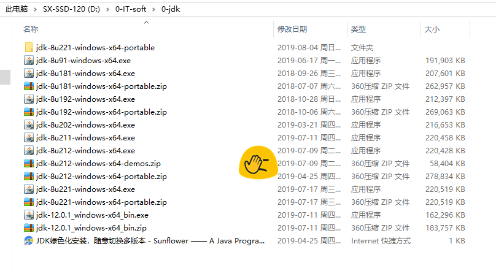
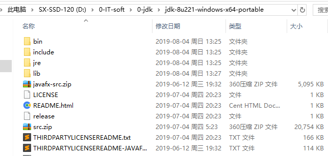
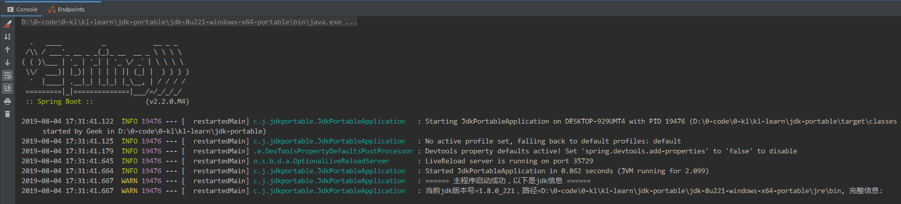

# jdk-portable 绿色版带源码注释操作说明
---
## 为什么会有这个项目：
- 之前在开发公司的项目时，需要使用代理ip，但是这个代理ip比较矫情，严重依赖低于jdk8u91(JDK-1.8-91)，一般我在给一台工作电脑初始化JAVA开发环境时，都会默认安装Oracle 官网 JDK1.8的最新版本，于是，就导致了代理ip频繁的报错，然后找到故障原因需要切换低版本jdk，于是就安装了几个版本jdk备用；  
- 后来的问题有点奇葩，我的电脑安装不上jdk1.8-202以上的版本，点击下一步就闪退，也查不到原因，如果有大佬找到了原因麻烦在此库发表 issue 告知，万分感谢；  
- 再后来的使用过程为了方便，我想能不能直接绿化，不依赖于图形化安装界面，这样我就可以快速切换不同版本了，于是jdk目录的画风就是这样了：  
  

> 参考链接：[JDK绿色化安装，随意切换多版本 https://blog.csdn.net/u011977189/article/details/78765374](https://blog.csdn.net/u011977189/article/details/78765374)  

- 按照上边链接提供的方法，我的确安装了很多版本 JDK，但是用的时候发现阅读源码显示的是反编译的不带注释的代码（var ****），而不是java源码，这就比较蛋疼了，于是我反复研究了安装版和绿色版的文件区别，对比了文件个数和大小，没找到破绽，今天无意的机会，被我发现了，最关键的源代码文件 src.zip 才是我们需要的带注释java源码的zip压缩包，jdk 绿色版完整文件结构如下：  
  
- src.zip 文件来源：在exe安装包解压出来的 CAB9 目录下面的 110 目录，解压获得src.zip，复制到解压的111~/tools,也就是最终的 jdk 主目录下面，否则idea 查看源码的时候是反编译得到的文件而不是源码，而且没有注释。 
   

- jdk 其他版本依此类推，推荐使用基数后缀版本，原因：  
[https://www.xncoding.com/2018/05/28/java/jdk.html](https://www.xncoding.com/2018/05/28/java/jdk.html)  
> 每次去Oracle官网去下载JDK，就会发现有两个版本，一个基数版本，一个偶数版本。比如最新的jdk-8u191和jdk-8u192。这是咋回事？  
  这是官方对于奇数版本与偶数版本区别的解释：  
  从JDK版本7u71以后，JAVA将会在同一时间发布两个版本的JDK，其中：  
  奇数版本为BUG修正并全部通过检验的版本，官方强烈推荐使用这个版本。  
  偶数版本包含了奇数版本所有的内容，以及未被验证的BUG修复，Oracle官方表示：除非你深受BUG困扰，否则不推荐您使用这个奇数版本。  

- ~~想要快速获取绿色版jdk，你可以直接下载这个项目，就可以得到绿色版jdk~~(网速太慢，我传不上去，这里下载：[https://www.oracle.com/technetwork/java/jdk8-downloads-2133151.html](https://www.oracle.com/technetwork/java/jdk8-downloads-2133151.html)，然后手动执行cmd脚本赋权，配置环境变量即可食用。  
- idea 指定jdk路径以后跑一下main，看看结果如何。  
